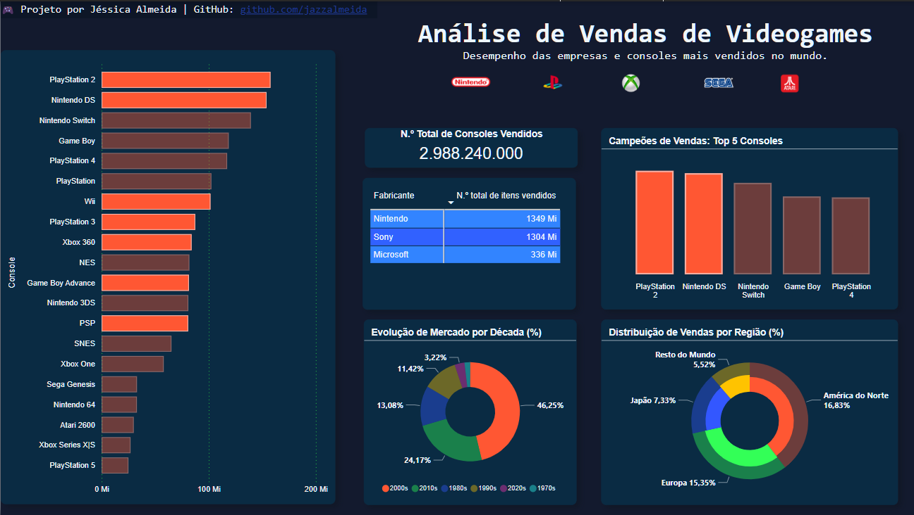
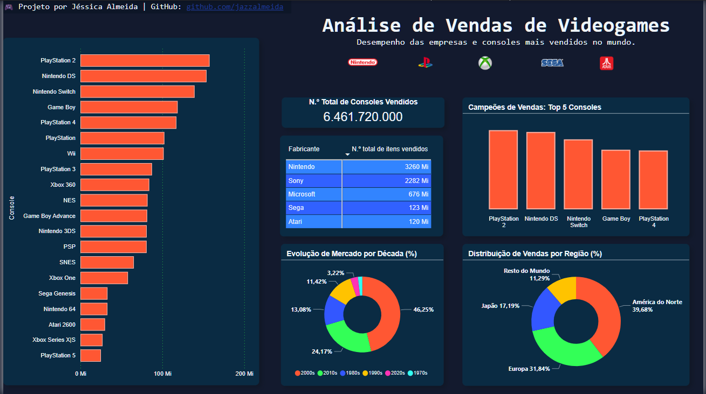

# Análise de Vendas de Videogames

**Desempenho das empresas e consoles mais vendidos da história**

Este projeto apresenta uma análise exploratória sobre as vendas históricas de consoles de videogame. O objetivo foi entender o desempenho das principais empresas do setor, observar tendências por região e identificar períodos de maior popularização dos consoles.

---

## Ferramentas utilizadas

- Power BI Desktop
- Power Query (ETL e transformação de dados)
- Microsoft Excel
- GitHub

---

## Estrutura do Projeto

```
venda_consoles/
├── dados/                  # Planilha com os dados brutos
│   └── vendas_consoles.xlsx
├── exports/                # Relatório exportado em PDF
│   └── analise_vendas_consoles.pdf
├── imagens/                # Prints do dashboard
│   ├── dashborad.png
│   ├── vendas_sony.png
│   ├── vendas_regiao_japao.png
│   └── popularizacao_anos00.png
├── analise_vendas_consoles.pbix  # Arquivo do Power BI
└── README.md
```

---

## Visão geral do dashboard

Arquivo exportado do Power BI:  
[Relatório em PDF](./exports/analise_vendas_consoles.pdf)

---

## Principais insights

**Sony: líder de vendas**  
A Sony se destaca com os maiores volumes de vendas no histórico, especialmente com consoles como o PlayStation 2.  


---

**Vendas por região – Japão**  
O mercado japonês é fortemente dominado por empresas locais, como Nintendo e Sony, com baixa penetração da Microsoft.  


---

**Destaques dos anos 2000**  
A década de 2000 marcou o maior crescimento nas vendas, consolidando os videogames como parte da cultura popular.  


---

**Painel geral do dashboard**  
Visão consolidada com gráficos comparativos, filtros por região, indicadores de total de vendas e destaques por fabricante.  


---

## Referência bibliográfica

Os dados utilizados neste projeto foram extraídos da base pública:  
**Video Game Sales with Ratings**. Disponível em: [Kaggle - vgsales](https://www.kaggle.com/datasets/gregorut/videogame-sales-with-ratings). Acesso em: abril de 2025.

---

## Sobre a autora

Jéssica Almeida é formada em Análise e Desenvolvimento de Sistemas e está em transição de carreira para a área de Análise de Dados. Possui conhecimento em ferramentas como Power BI, SQL, Python, Excel e Power Query, e vem construindo projetos para demonstrar suas habilidades em dados e visualização.
